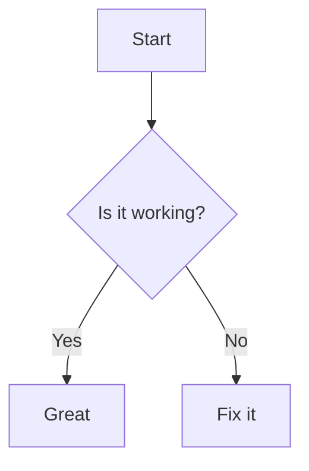

# Markdown Bench Test

Ce fichier sert à tester **l'affichage complet** d'un fichier Markdown : TOC, rendu visuel, ancrages, blocs spéciaux, etc.

---

## Titres

# H1
## H2
### H3
#### H4
##### H5
###### H6

---

## Texte

Texte en **gras**, *italique*, ***gras italique***, ~~barré~~.

Texte `inline code`.

---

## Listes

### Liste non ordonnée

- Un
- Deux
  - Sous-élément
    - Encore plus profond

### Liste ordonnée

1. Premier
2. Deuxième
3. Troisième

---

## Liens

[OpenAI](https://openai.com)

[Lien interne](#titres)

---

## Citations

> Ceci est une citation.
>
> > Et une citation imbriquée.

---

## Tableaux

| Nom     | Âge | Métier       |
|---------|-----|--------------|
| Alice   | 24  | Développeuse |
| Bob     | 30  | Designer     |

---

## Code

### Bloc de code JavaScript

```javascript
function hello(name) {
  return `Bonjour, ${name}`;
}
```

### Bloc de code Bash

```bash
#!/bin/bash
echo "Hello World"
```

---

:::alert
Ce fichier sert de benchmark pour tester les fonctionnalités Markdown.
:::

---

## Images


---

## Blocs spéciaux

> 💡 **Astuce** : Vous pouvez utiliser les emojis pour créer des alertes visuelles.

::: warning Avertissement
Ceci est un bloc de type "warning".
:::

::: tip Astuce
Ce fichier sert de benchmark.
:::

---

## Math

```math
E = mc^2
\int_{0}^{\infty} e^{-x} dx = 1
```

---

## Diagrammes Mermaid



---

## Détails/Accordion

<details>
<summary>Cliquer pour afficher</summary>

Ceci est du contenu caché.

</details>

---

## Footnotes

Voici un exemple avec une note de bas de page[^1].

[^1]: Ceci est la note.

---

## HTML brut

<div style="color: red; font-weight: bold;">
Ce texte est en HTML brut.
</div>
